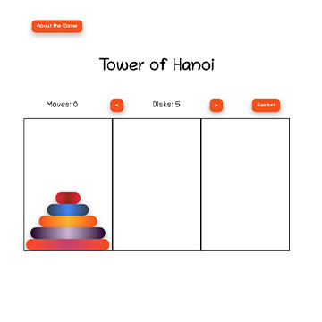

# SEIR-Project-1: Tower of Hanoi

For my first project at General Assembly I chose to build a Tower of Hanoi game using HTML, CSS, and Javascript. This project simulates the traditional Tower of Hanoi game in which the user can play in various difficulties.

## Features

User can play a typical game of Tower of Hanoi by moving the disks to another column.
All rules and game logic are in place.
The user can change the level on demand, and upon successful completion of a level, the next level automatically begins.
The user can reset the current state of the game at any time.

## Technologies Used

HTML, CSS (Grid and Flexbox), Javascript

## Bugs Still Unresolved

- When a larger disk is dropped _directly_ on top of a smaller disk, the logic to prevent that from happening does not work; logic works as long as the disk is placed _above_ the smaller disk
- If a disk is dropped _outside_ one of the columns, the checkWin function fires

## Future Additions

- Add a "solve" button that uses the generally accepted recursion method to solve the game
- Add Media Queries for responsive design

## Sources of Research

Traversy Media - YouTube Channel - draggable HTML elements

## New Concepts Learned

- setAttribute("draggable", false)
- insertBefore()
- dragEnd vs. dragDrop
- clientWidth
- Became very comfortable with the event object and navigating the path, target, and other key:value pairs of the object
- childElementCount
- previousElementSibling
